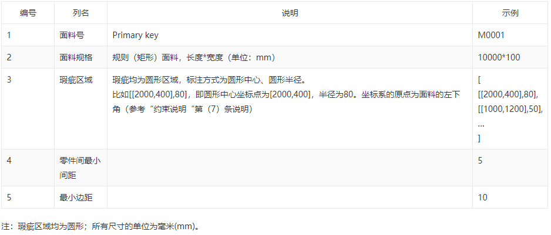
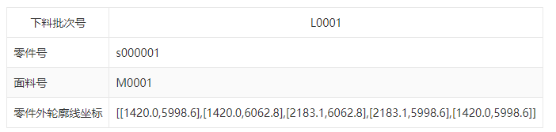

# **面料剪裁利用率优化**

## 目标

- 初赛：基于所给零件，进行面料排版加工，耗料长度最短，面料利用率最高。
- 复赛：在初赛的基础上，避开瑕疵区域面料加工，耗料长度最短，面料利用率最高。

## 约束条件

- 零件互不重叠；
- 同一批次零件在同一面料上排版；
- 最小边距（面料四周预留宽度）；零件间最小间距；
- 旋转角度：逆时针旋转；
- 避开瑕疵（圆形区域）；

## 数据说明

### 零件数据

### 面料数据

### 结果格式

## 参考资料

[https://svgnest.com/](https://svgnest.com/?spm=5176.12281978.0.0.12af4bffjGB1qr)